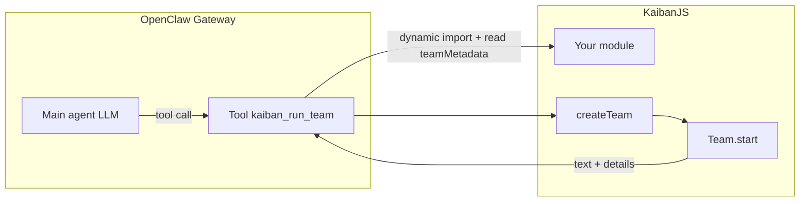

# @kaibanjs/kaibanjs-plugin

Native [OpenClaw](https://docs.openclaw.ai/) plugin that registers a **KaibanJS `Team`** as a single tool (`kaiban_run_team`) for OpenClaw’s main agent. You implement the Team in a normal TypeScript module; the plugin loads it at Gateway startup and wires it into OpenClaw’s tool-calling layer.

This package lives in the **KaibanJS monorepo** at:

`packages/openclaw-plugin/`

You do **not** need to publish it to npm to use it: install the folder into OpenClaw from disk (see below).

---

## What problem this solves

OpenClaw’s orchestrator decides *when* to call tools and passes structured arguments. KaibanJS runs multi-agent **Teams** with tasks, agents, and optional tools (e.g. web search). This plugin connects the two: the main agent calls one tool; behind it, your Team runs end-to-end and the workflow result is returned as tool output.

---

## How the plugin works

1. **Startup** — OpenClaw loads the plugin entrypoint ([`index.ts`](./index.ts)) and calls `register(api)` with your plugin id and config.
2. **Config** — The plugin reads `plugins.entries.<id>.config.team` from OpenClaw (see [`openclaw.plugin.json`](./openclaw.plugin.json) for the validated shape). Required: `team.modulePath` pointing to **your** TypeScript module (absolute path is safest on the Gateway host).
3. **Dynamic import** — That module is `import()`ed via a `file:` URL. OpenClaw may supply `api.resolvePath` to normalize paths.
4. **Metadata** — The plugin reads `teamMetadata` (name configurable via `metadataExportName`, default `teamMetadata`):
   - `description` → becomes the **tool description** shown to the LLM (when to use the tool).
   - `inputs` → optional JSON Schema fragment for the **`inputs`** object of the tool. If present, it is merged into `parameters.properties.inputs` so the model sends the same keys your `createTeam` expects.
5. **Factory** — It loads `createTeam` (name configurable via `exportName`, default `createTeam`) and validates it is a function.
6. **Tool registration** — It registers one tool:
   - **Name:** `kaiban_run_team`
   - **Parameters:** `{ inputs: <your schema or loose object> }`
   - **Execute:** merges `config.team.defaults` with the tool’s `inputs`, calls `createTeam({ inputs, ctx })`, then `team.start()` with no extra override (inputs are already applied inside `createTeam`). The string shown to the user is derived from the workflow result (`result` field when present).



---

## Repository layout (KaibanJS)

| Path | Role |
|------|------|
| [`packages/openclaw-plugin/index.ts`](./index.ts) | Plugin runtime: register tool, execute Team |
| [`packages/openclaw-plugin/openclaw.plugin.json`](./openclaw.plugin.json) | Manifest: plugin id `kaibanjs-plugin`, JSON Schema for plugin config |
| [`packages/openclaw-plugin/package.json`](./package.json) | Package name `@kaibanjs/kaibanjs-plugin`, `openclaw.extensions` entry |
| [`packages/openclaw-plugin/examples/example.ts`](./examples/example.ts) | Reference Team + `teamMetadata` |

The **npm package name** is `@kaibanjs/kaibanjs-plugin`. OpenClaw’s discovery uses it to infer an id hint; the **manifest id** in `openclaw.plugin.json` is `kaibanjs-plugin`. Your `openclaw.json` entry key must match that id: `plugins.entries.kaibanjs-plugin`.

---

## Getting the plugin without cloning the whole KaibanJS repo

If you only need this folder (`packages/openclaw-plugin`) and not the full monorepo, common options:

1. **degit** (Node / `npx`) — fetches a subtree of the GitHub repo without the rest of the tree:

   ```bash
   npx --yes degit kaiban-ai/KaibanJS/packages/openclaw-plugin openclaw-plugin
   ```

2. **Git sparse checkout** — clone with `--sparse` and check out only `packages/openclaw-plugin` (requires a recent `git`):

   ```bash
   git clone --depth 1 --filter=blob:none --sparse https://github.com/kaiban-ai/KaibanJS.git kaibanjs-tmp
   cd kaibanjs-tmp
   git sparse-checkout set packages/openclaw-plugin
   ```

   The plugin files are under `packages/openclaw-plugin/`. You can copy that directory elsewhere and remove `kaibanjs-tmp` if you no longer need it.

3. **GitHub in the browser** — open [KaibanJS on GitHub](https://github.com/kaiban-ai/KaibanJS), go to `packages/openclaw-plugin/`, and use **Code → Download ZIP** on the repo (you get the full repo zip) and extract only `packages/openclaw-plugin`, or use a third-party “folder download” if you prefer.

After you have the folder on the Gateway machine, point `openclaw plugins install` at that directory (see below).

---

## Prerequisites

- **OpenClaw Gateway** installed and runnable on the machine where you install the plugin.
- **Node.js** compatible with OpenClaw and KaibanJS.
- **`kaibanjs`** available to the runtime that loads your team module (same `node_modules` tree as the Gateway, or a path OpenClaw can resolve when importing your file).
- **Peer dependencies** (for the bundled example and typical Teams): `kaibanjs`, and optionally `@langchain/tavily` if your Team uses Tavily like the example.

---

## End-to-end: install and configure

### 1. Get the plugin onto the Gateway host

- **Full KaibanJS clone** (development): use `/path/to/KaibanJS/packages/openclaw-plugin`.
- **Only this package**: see [Getting the plugin without cloning the whole KaibanJS repo](#getting-the-plugin-without-cloning-the-whole-kaibanjs-repo), then point OpenClaw at the directory you extracted.

### 2. Install the plugin into OpenClaw

On the **Gateway** machine:

```bash
openclaw plugins install /absolute/path/to/KaibanJS/packages/openclaw-plugin
openclaw stop
openclaw start
```

Use the same path style you use for other local OpenClaw plugins. After edits to the plugin code, reinstall or ensure the installed copy tracks your sources (symlink/copy behavior depends on OpenClaw version).

### 3. Install extra npm deps your Team needs

The example uses Tavily:

```bash
npm install @langchain/tavily
```

Run this in the **project/environment** where OpenClaw resolves modules for your `modulePath` (often the Gateway working directory or a linked app).

### 4. Environment variables

Whatever your `createTeam` / Team use (e.g. `OPENAI_API_KEY`, `TAVILY_API_KEY`) must be set in the **process environment of the OpenClaw Gateway**, same as any other server-side secret.

### 5. Configure `openclaw.json`

**Enable the plugin** and point `team.modulePath` at **your** module. The path must exist on the Gateway filesystem.

```json5
{
  plugins: {
    enabled: true,
    entries: {
      "kaibanjs-plugin": {
        enabled: true,
        config: {
          team: {
            modulePath: "/absolute/path/to/your/team.ts",
            exportName: "createTeam",
            metadataExportName: "teamMetadata",
            defaults: {}
          }
        }
      }
    }
  }
}
```

- **`modulePath`** — File that exports `teamMetadata` and `createTeam` (or your custom export names).
- **`exportName`** — Factory function (default `createTeam`).
- **`metadataExportName`** — Object with `description` and optional `inputs` schema (default `teamMetadata`).
- **`defaults`** — Object merged into tool `inputs` before `createTeam` (optional).

**Allow the tool** for the agent that should call KaibanJS:

```json5
{
  agents: {
    list: [
      {
        id: "default",
        tools: {
          allow: ["kaiban_run_team"]
        }
      }
    ]
  }
}
```

Restart the Gateway after config changes.

---

## Your team module contract

Export:

1. **`teamMetadata`** (or the name set in `metadataExportName`):
   - **`description`** (string, required) — Shown to the main LLM as the tool description.
   - **`inputs`** (optional) — JSON Schema for the **`inputs`** parameter: `type: "object"`, `properties`, `required`, `additionalProperties` (recommended `false` so keys match `createTeam`).

2. **`createTeam`** (or `exportName`) — Function:

   ```ts
   ({ inputs: Record<string, unknown>, ctx?: { sessionId?, agentId?, channelId? } }) => Team | Promise<Team>
   ```

   Build and return a KaibanJS `Team`; put user-facing inputs on the Team inside this function. The plugin calls `team.start()` with no arguments after `createTeam` returns.

See [`examples/example.ts`](./examples/example.ts) for a full pattern.

---

## Tool surface

| Field | Value |
|--------|--------|
| Tool name | `kaiban_run_team` |
| Arguments | `{ inputs: { ... } }` — shape from `teamMetadata.inputs` or generic object |
| Return | OpenClaw tool result with `content` text and `details.workflowResult` |

---

## Troubleshooting

- **`plugin id mismatch` (manifest vs entry hint)** — Keep `openclaw.plugin.json` `"id": "kaibanjs-plugin"` aligned with `plugins.entries.kaibanjs-plugin`. The package name `@kaibanjs/kaibanjs-plugin` is chosen so the inferred hint matches; avoid renaming one without the other.
- **Missing config** — Plugin throws if `config.team` is missing or `modulePath` / `description` / `createTeam` are invalid at load time.
- **Wrong tool keys** — Define `teamMetadata.inputs` with explicit `properties` and `additionalProperties: false` so the main agent sends the same keys as your code.

---

## Further reading

- [OpenClaw plugins / manifest](https://docs.openclaw.ai/plugins/manifest)
- KaibanJS `Team`, `Agent`, and `Task` in the main repository documentation.
